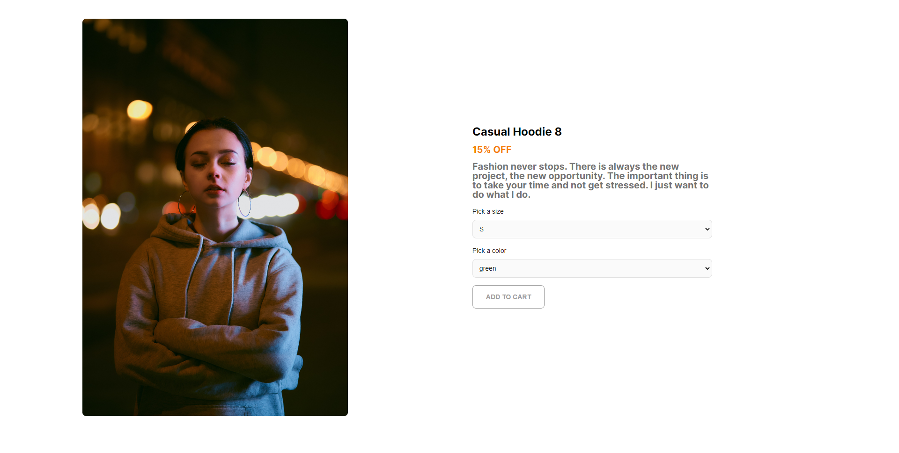

Сайт магазина одежды. Технологии используемые при создании сайта: React, Redux Toolkit, tialwind, material-tailwind. 

Проект доступен по ссылке: https://alexandrpodenkov.github.io/clothes-store/

При переходе по ссылке вы перейдёте на страницу авторизации, чтобы её пройти нужно ввести любой логин и пароль, последнее поле заполнять не обязательно.
 

